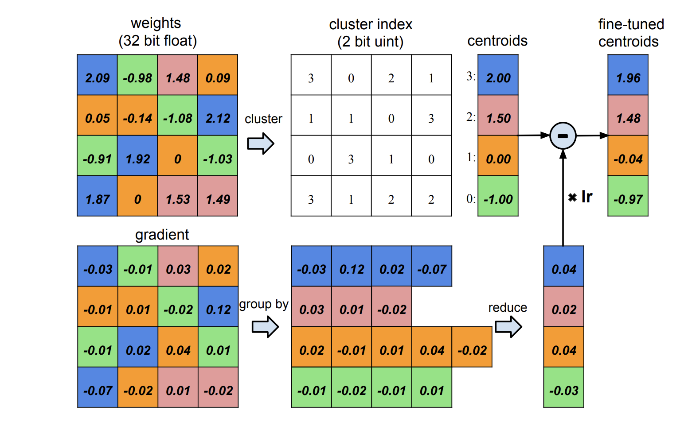
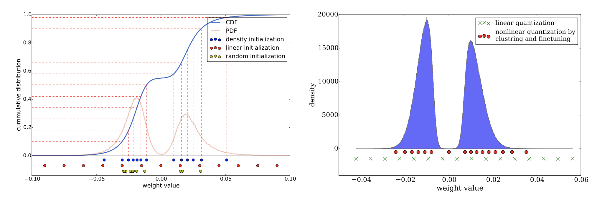
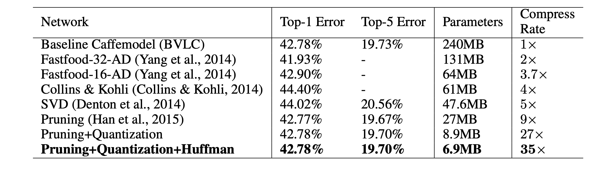

# DEEP COMPRESSION
#### DEEP COMPRESSION: COMPRESSING DEEP NEURAL NETWORKS WITH PRUNING, TRAINED QUANTIZATION AND HUFFMAN CODING
##### Published as a conference paper at ICLR 2016
##### Song Han∗, Huizi Mao$, William J. Dally∗†,
##### ∗ Stanford University   † NVIDIA $ Tsinghua University

## Problem

Neural networks are computationally and memory-intensive, making it challenging to deploy them on embedded systems with limited hardware resources.

## Importance

This limitation hinders the deployment of deep neural networks on mobile devices, which could offer benefits such as better privacy, reduced network bandwidth usage, and real-time processing. Furthermore, energy consumption is a significant concern, as running large neural networks requires substantial memory bandwidth and computational power..

## Insights

The article introduces a three-stage pipeline called "deep compression," which includes pruning, trained quantization, and Huffman coding. These stages work together to significantly reduce the storage requirement of neural networks without compromising their accuracy. Pruning removes unimportant connections, quantization enforces weight sharing, and Huffman coding further compresses the data. These techniques can reduce storage requirements by 35× to 49×.

## Mechanism

1-Pruning: Initially, unimportant connections are removed from the network by learning only the essential connections.

2-Quantization: Weights are quantized, allowing multiple connections to share the same weight, reducing the number of bits needed to represent each connection.

3-Huffman Coding: This stage takes advantage of the biased distribution of effective weights to further compress the network.

## Results

- On the ImageNet dataset, this method reduced the storage required by AlexNet from 240MB to 6.9MB (35× reduction) and VGG-16 from 552MB to 11.3MB (49× reduction), with no loss of accuracy.

- The compressed network achieved 3× to 4× layerwise speedup and 3× to 7× better energy efficiency when benchmarked on CPU, GPU, and mobile GPU.

- This approach allows complex neural networks to be used in mobile applications with limited storage and power constraints.