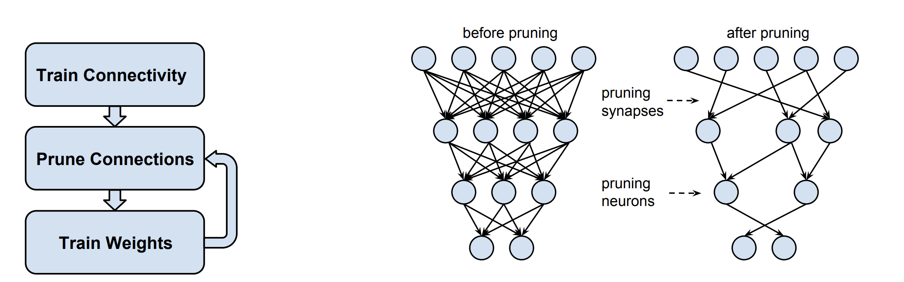
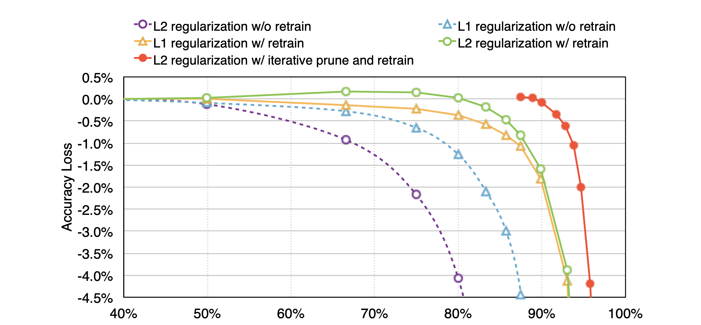

# Pruning CNN
#### Pruning CNN: Learning both Weights and Connections for Efficient Neural Networks
##### Published as a conference paper at ICLR 2016
##### Song Han∗, John Tran†, William J. Dally∗†,Jeff Pool†
##### ∗ Stanford University   † NVIDIA 

## Problem

Neural networks are computationally and memory-intensive, making them unsuitable for deployment on embedded systems. Additionally, conventional neural networks have fixed architectures that cannot adapt during training, limiting their potential for improvement

## Importance

Efficient deployment of neural networks on resource-constrained devices is crucial for practical applications. The ability to adapt the network architecture during training can lead to more effective models.

## Insights

The proposed method aims to address these issues by significantly reducing the storage and computational requirements of neural networks while maintaining their accuracy. This is achieved by identifying and pruning unimportant connections. The process involves training the network to recognize important connections, pruning the unimportant ones, and fine-tuning the remaining connections.

## Mechanism

1- Training to Identify Important Connections: The network is trained to learn which connections are important for its task.

2- Pruning Unimportant Connections: Connections with low importance are pruned, effectively converting dense layers into sparse layers.

3- Retraining to Optimize Remaining Connections: The pruned network is retrained to optimize the weights of the remaining connections, compensating for the pruned ones.

## Results

On the ImageNet dataset, this method reduced the parameters of AlexNet by a factor of 9×, from 61 million to 6.7 million, without any loss of accuracy. Similar experiments with VGG-16 achieved a 13× reduction in the total number of parameters, from 138 million to 10.3 million, with no impact on accuracy. This approach greatly enhances the efficiency of deploying neural networks on embedded systems and allows architectures to adapt during training for improved performance.