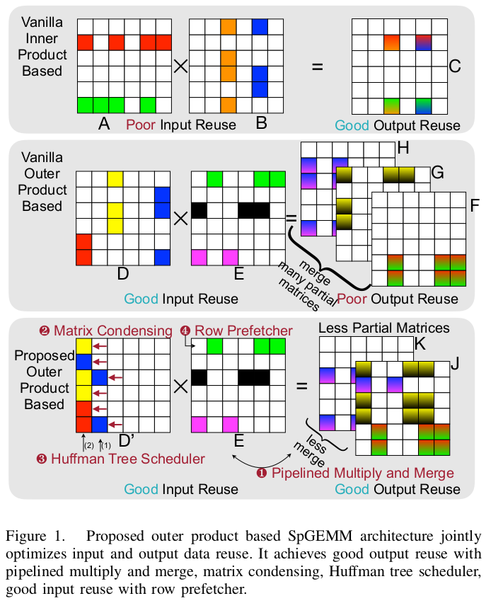
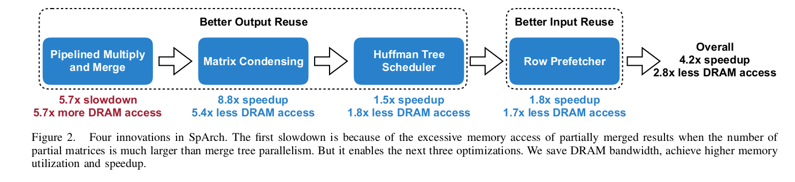

# SpArch
#### Efficient Architecture for Sparse Matrix Multiplication
##### The 26th IEEE International Symposium on High-Performance Computer Architecture (HPCA 2020)
##### **Zhekai Zhang, Hanrui Wang, Song Han** Massachusetts Institute of Technology
##### **William J. Dally** Stanford University / NVIDIA

## Problem
Dense matrix multiplication is computation bound but on contrast sparse matrix multiplication is memory access bound due to the operand irregularity and lack of spatial locality.

## Importance
- Generalized sparse matrix-matrix multiplication (SpGEMM) is the key computing kernel for many algorithms.
- Performance of SpGEMM is memory bounded on the traditional general-purpose computing platforms such as CPUs and GPUs, because of the irregular memory access pattern and poor locality caused by low-density matrices.

## Insights
- Data should be re-used and computations should be more coalesced.
- Previous approaches focus only on input or output.



By condensing inputs, there would be less partial outputs and less merge, multiplications and memory access would be required.

```
The motivation of matrix condensing is that if we have two columns a1 , a2 from the left matrix that have no elements sharing the same row index, we can merge them (i.e., combine them into a new array sorted by the row index) while keeping the original column index.

Furthermore, since exchanging elements between different columns does not affect the final result, we condense all elements in a row to the leftmost column. In this way, the number of columns of the condensed left matrix is far less than the original one.
```
<!-- TODO outer product mechanism -->
<!-- TODO should we keep track of indices? -->
<!-- TODO prefetching inputs? -->

## Mechanism

- Pipeline the multiply stage and the merge stage with a comparator array-based highly parallelized merger. Use matrix-condensing to condense the first input matrix, reducing the number of partial matrices by three orders of magnitude.
- A Huffman tree scheduler that provides a near-optimal merge order of partial matrices and reduces the DRAM traffic.

        A Huffman tree minimizes the sum of all nodes’ weights. We apply it to minimize the total DRAM traffic. Scheduled by a Huffman tree, we merge matrices with fewer non-zeros first and larger ones later.

- A row prefetcher that achieves near-optimal buffer replacement policy for the second input matrix and resolves the increased DRAM read induced by matrix condensing.



```
For large matrices, however, the number of partial matrices exceeds the merger’s parallelism. Merging only a part of partial matrices at a time with multiple rounds leads to an increased amount of memory access for the partially merged results, which neutralizes the performance gain of pipelined multiple and merge, making DRAM access even larger.
```
## Results
On average, SpArch achieves 4×, 19×, 18×, 17×, 1285× speedup and 6×, 164×, 435×, 307×, 62× energy savings over OuterSPACE, MKL, cuSPARSE, CUSP, and ARM Armadillo, respectively
<!-- TODO huffman mechanism -->
<!-- TODO Architecture -->
<!-- TODO prefetching mechanism -->

